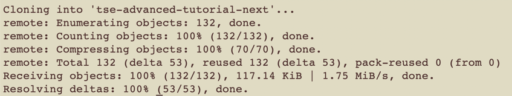
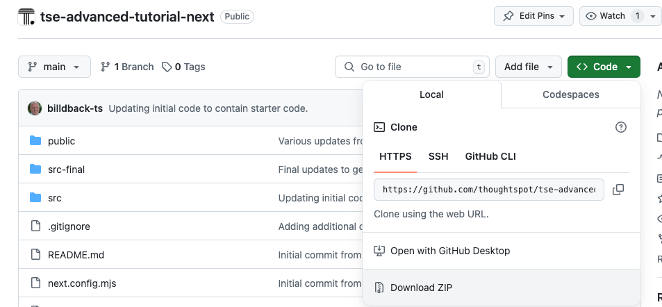
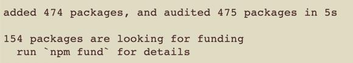
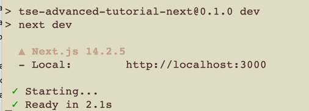
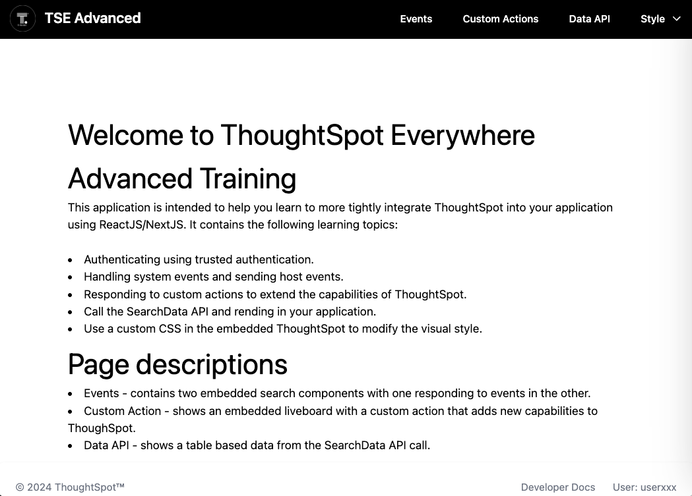

# TSE Advanced Tutorial Next

This repository contains the code for an example React.js/Next.js application that embeds ThoughtSpot.

## Requirements

For this exmple, you will need the following:

- (optional) `git` command line if using the `git clone` download. See the [Git Clone Section](#git-clone)
- `npm`, aka Node Package Manager. This code has been testing on 10.8.3+, but any modern version should work.
- An IDE such as [VS Code](https://code.visualstudio.com/), [PyCharm](https://www.jetbrains.com/pycharm/) or similar
  that supports React apps.

## Setting up for training

First you need to download the code. There are two approaches, you can clone the code using `git clone` or you can
download the code. `git clone` is recommended, but both approaches work.

### Git clone

This approach requires you to have git installed on your computer. From the command line run
`git clone https://github.com/thoughtspot/embed-example-react-app`. You should see messages like the following and a
new folder, called `embed-example-react-app` will be created.

### Download code

Alternatively, you can download the code from GitHub using the UI.

This will download a file called `embed-example-react-app-main.zip`. Unzip the file and you get a directory
called `embed-example-react-app-main`.

## Install dependencies

Now that you've downloaded the code from GitHub, you need to install dependencies. `cd` into the directory name based
on your download option. Then run `npm install`. You may see some warnings, but can typically ignore those. You will get
a message like the following once the installation is complete:

## Starting the application

Finally, run `npm run dev`. You should see a message saying the server has started.

Open [http://localhost:3000](http://localhost:3000) with your browser to see the starting page.

## Technical links

The following are links to the main technologies used in this example.

- [ThoughtSpot React documentation](https://developers.thoughtspot.com/docs/react-app-embed) for details on how to
  install and use TS React components.
- [React developer site](https://react.dev/) to learn more about React.
- [Next.js developer site](https://nextjs.org/) to learn more about Next.js
- [Typescript Language site](https://www.typescriptlang.org/) to learn more about typescript.
- [Flowbite for React](https://flowbite-react.com/) to learn about the components used in this application.
